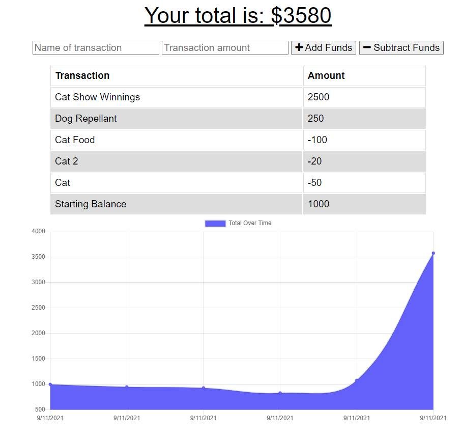

# 19-PWA-02-Homework: Online/Offline Budget Tracker

## Description

Online/Offline Budget Tracker

## Table of Contents

- [Description](#description)
- [Usage](#usage)
- [Credits](#credits)
- [License](#license)
- [How to Contribute](#how-to-contribute)

## Installation

npm i /npm start

## Usage

When first loading the page, enter in the name and amount of the transacation and click on either the Add Funds or Subtract Funds buttons at the top of the page.  This will then add it to the list of transactions.

## Credits

University of Minnesota Boot Camp:
https://umn.bootcampcontent.com/University-of-Minnesota-Boot-Camp

## License

## How to Contribute

[Contributor Covenant](https://www.contributor-covenant.org/)

## Questions

- For additional help or questions about collaboration, please reach out to jeffseverson2001@gmail.com

- Follow me on Github at [jeffseverson2001](http://github.com/jeffseverson2001)
